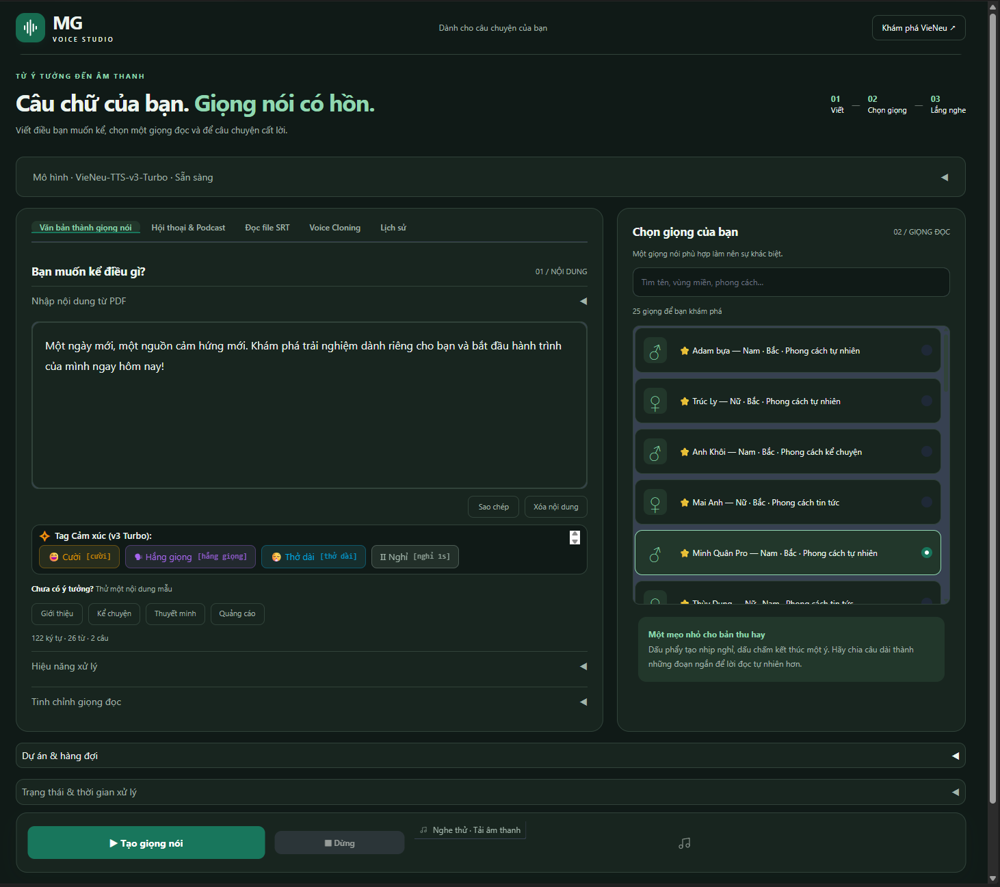

# MG Voice Studio

Ứng dụng chuyển văn bản tiếng Việt thành giọng nói trên máy tính, với giao diện
soạn thảo, thư viện giọng và lịch sử bản thu.

## Tải xuống

**Bộ cài MG Voice Studio đang được chuẩn bị; hiện chưa có phiên bản phát hành.**

Các bộ cài sẽ được đăng tại [GitHub Releases](https://github.com/arapat1412/mg-voice-studio/releases).
Đây là kho giới thiệu và phân phối ứng dụng. File `.exe` được đính kèm từng
Release, không lưu trong lịch sử Git của kho này.

## Tính năng

- Đọc văn bản tiếng Việt với giọng dựng sẵn và giọng đã lưu.
- Biểu tượng ♂ / ♀ giúp nhận biết giọng nam và nữ.
- Nhân bản giọng từ audio mẫu, lưu giọng để dùng lại.
- Hội thoại & podcast với nhiều giọng.
- Trích xuất văn bản từ PDF và tạo audio từ file SRT.
- Lưu dự án; xếp hàng nhiều đoạn/chương và tiếp tục các mục chưa hoàn tất.
- Lịch sử cục bộ: nghe lại, tải WAV/MP3/SRT, mở thư mục và xóa bản thu.
- Tự dọn lịch sử cũ nhất khi vượt 300 bản hoặc 1 GB.
- Chạy bằng CPU; có lựa chọn GPU NVIDIA khi môi trường hỗ trợ.

MP3 phụ thuộc bộ mã hóa trên máy. SRT của văn bản thường là một đoạn cho toàn
bản thu; luồng đọc SRT xuất mốc thời gian theo các câu đã tổng hợp.

## Cài đặt và sử dụng

Khi có Release dành cho **Windows x64**:

1. Tải bộ cài từ mục Releases và cài ứng dụng.
2. Mở ứng dụng, chọn model và thiết bị xử lý rồi bấm **Tải model**.
3. Chọn giọng, nhập nội dung và bấm **Tạo giọng nói**.
4. Mở **Lịch sử** để nghe và tải lại các bản hoàn tất.

Lần đầu dùng có thể cần Internet để tải model và các thành phần GPU tùy chọn.
Khi các tài nguyên cần thiết đã có trên máy, chế độ model cục bộ có thể tạo
giọng mà không cần gửi văn bản đến dịch vụ TTS bên ngoài. Tốc độ phụ thuộc
model, độ dài văn bản và cấu hình máy.

## Lưu trữ

Bản desktop lưu dữ liệu mặc định tại `%LOCALAPPDATA%\VieNeu`.
Biến môi trường `VIENEU_HOME` cho phép đổi thư mục dữ liệu. Audio lịch sử và
dự án được lưu riêng; xóa lịch sử không xóa audio riêng của dự án hoặc các
file đã tải xuống. Xem [Thông tin dữ liệu và quyền riêng tư](PRIVACY.md).

## Góp ý và báo lỗi

Tạo [Issue](https://github.com/arapat1412/mg-voice-studio/issues) với mô tả lỗi,
phiên bản ứng dụng, hệ điều hành và các bước tái hiện. Kiểm tra và xóa thông tin
cá nhân trước khi đăng log hoặc audio.

## Nguồn gốc và giấy phép

MG Voice Studio được tùy chỉnh từ [VieNeu-TTS](https://github.com/pnnbao97/VieNeu-TTS)
của **Phạm Nguyễn Ngọc Bảo**, sử dụng VieNeu-TTS v3 cho chức năng tổng hợp giọng.
Các thay đổi gồm giao diện MG, lịch sử bản thu, quản lý dự án/hàng đợi và biểu
tượng giới tính của giọng.

Xem [LICENSE](LICENSE) và [THIRD-PARTY-NOTICES.md](THIRD-PARTY-NOTICES.md).
Các thư viện và model giữ giấy phép riêng của từng thành phần.
